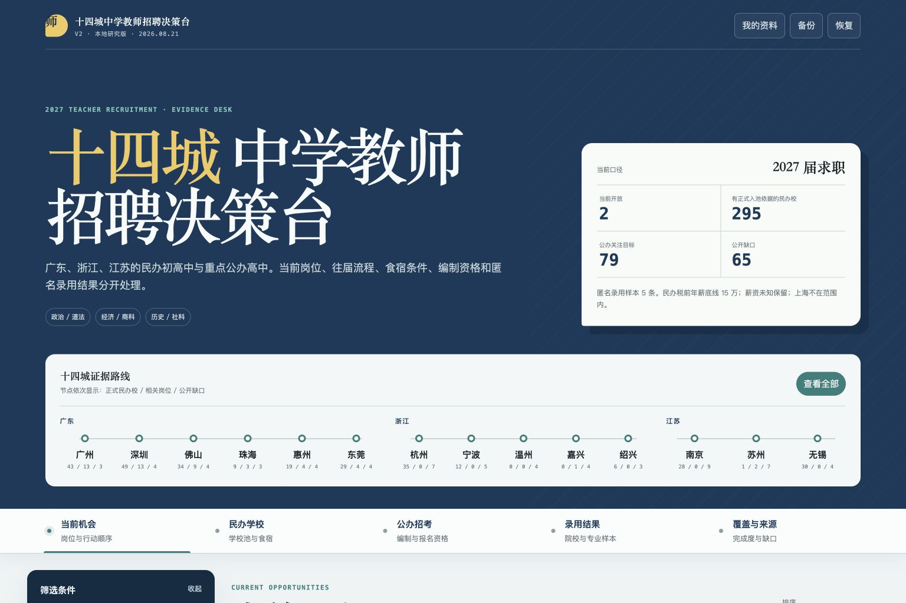

# 十四城中学教师招聘决策台

面向中学教师求职决策的证据型信息台。它将公开招聘信息拆成可核查的岗位、学校、申请状态和来源字段，帮助使用者比较广东、浙江、江苏十四城的民办与重点公办学校机会。

[在线演示](https://guangdong-teacher-jobs-2027.baymax1001.chatgpt.site) · [本地运行](#本地运行) · [证据与数据边界](#证据与数据边界)



## 作品概览

- 14 个城市、80 条岗位记录、384 所正式学校
- 当前机会、民办学校、公办招考、录用结果、覆盖与来源五个视图
- 字段级来源、招聘周期、访问状态和证据等级
- 分阶段研究导入：暂存资料必须通过结构校验和显式允许清单，才会进入正式数据
- 收藏、比较、个人备注、材料清单、CSV 导出和本地备份

## 我的角色与 AI 协作

我负责需求范围、城市与岗位口径、证据规则、产品取舍和最终验收。Claude Code、DeepSeek Harness 与 Codex 分别参与代码实现、公开资料的结构化试采和独立复核。正式数据不由模型自动写入：采集结果先进入暂存区，通过校验和人工审核后再合并。

> V2（2026-08-21）：严格包含广州、深圳、佛山、珠海、惠州、东莞、杭州、宁波、温州、嘉兴、绍兴、南京、苏州、无锡，不包含上海。顺德归属佛山市。当前保留全部 48 个 V1 岗位 ID，并接入原生公办岗位、十四城学校池、字段证据、公开缺口和匿名录用结果。官方名单无法恢复时显示缺口，不用第三方来源补成已确认。
>
> 2026-08-27 发布基线：浙苏 8 城（杭州、宁波、温州、嘉兴、绍兴、南京、苏州、无锡）的八个已审核 DSH 批次通过显式允许清单集成；未来写入 `research/staging/dsh/` 的资料不会自动进入正式页面。岗位总数 80 条（48 条 V1 无损迁移 + 32 条原生 V2/扫描），正式学校池 384 所。状态按公告语义与 UTC+8 当前日期统一计算。

## 本地运行

```bash
npm ci
npm run dev
```

## 检查与导出

```bash
npm run lint
npm run typecheck   # TypeScript 严格类型检查（tsc --noEmit）
npm test                 # 自动生成导出数据、构建并运行测试
npm run validate:intake  # 无网络校验 CodeBuddy 城市资料包
npm run handoff:targets   # 从正式数据生成指定城市试采目标（默认宁波；可传城市名，如：npm run handoff:targets -- 杭州）
npm run validate:scan    # 无网络校验 DSH 招聘扫描暂存资料；按城市自动加载 research/handoff/<city>-targets.json
npm run check:links   # 批量检测外链并报告异常（需联网；加 -- --strict 可令异常返回非零退出）
npm run export:data   # 单独生成最新 JSON 导出
npm run reports:v2   # 从正式数据生成 Markdown 清单与覆盖报告
```

- 网站数据（V1 兼容层 + 十四城 V2 入口）：`app/recruitment-data.ts`
- V2 数据层：`app/data/`（`legacy.ts`、`migration.ts`、`intake-adapter.ts`、`native-v2.ts`）
- V2 类型：`lib/recruitment-types.ts`
- 阶段 B 城市资料模板：`research/templates/city-intake.template.json`
- 阶段 B 资料校验器：`scripts/validate-research-intake.mjs`
- DSH 招聘扫描模板：`research/templates/recruitment-scan.template.json`
- DSH 招聘扫描校验器：`scripts/validate-recruitment-scan.mjs`
- DSH 试采目标：`research/handoff/<城市>-targets.json`（宁波、温州、嘉兴、绍兴、苏州、杭州、无锡、南京）
- DSH 招聘扫描：`research/staging/dsh/<城市>-recruitment-scan-2026-08-21.json`（同城批次报告在扫描文件内）
- Markdown 清单：`outputs/十四城招聘追踪清单.md`
- JSON 数据：`outputs/广东民办中学教师_2027秋招数据.json`（V1）、`outputs/十四城决策台_V2数据.json`（V2）
- 外链状态：`outputs/外链健康检查摘要.md`

## 页面功能

- 五视图：当前机会、民办学校、公办招考、录用结果、覆盖与来源
- 筛选：省份、城市、区县、性质、学段、方向、状态、薪资、住宿、餐食、授课语言、教师资格、经验、选拔流程、匹配风险和关键词
- 民办默认隐藏年薪上限仍低于15万元的岗位，薪资未知保留；公办不使用民办薪资分淘汰
- 收藏、跟进状态、个人备注、最多4项比较、CSV、投递待办、备份恢复
- 浏览器内个人资料、公办资格判断、报名材料清单、食宿询问清单、十四城比较表和城市备注

网站不登录招聘账号、不代投、不联系学校。收藏、跟进、备注、城市判断和个人资料仅写入当前浏览器的 `localStorage`。

## 证据与数据边界

- 本仓库是截至 2026-08-27 的研究与产品发布基线，不保证招聘状态在此后仍然有效。
- 搜索摘要、无法访问的页面和往年公告不会被标成当前正式招聘证据。
- 数据中的公开邮箱和链接来自招聘页面，只用于追溯来源；仓库不包含求职者个人数据。
- 使用者应在投递前重新查看学校或主管部门的最新公告。

## 许可证

源代码按 [MIT License](LICENSE) 发布。招聘公告、学校名称、公开联系方式及其他来源内容的权利归原发布者所有。
